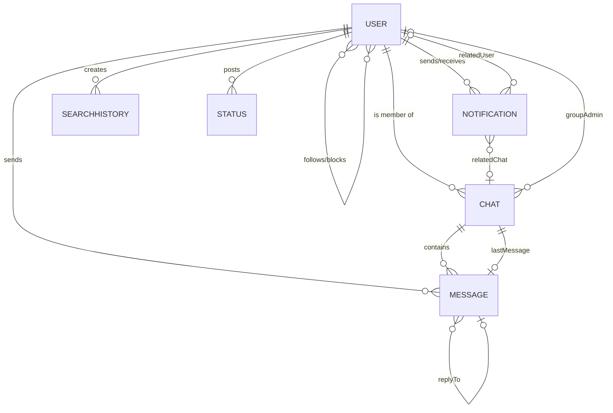

# Franxx ChatWeb — MongoDB Database Documentation

This document describes the complete MongoDB database structure used by the **Franxx ChatWeb** application. It is generated from the actual Mongoose model schemas located in [`franxx_backend/models/`](../franxx_backend/models/).

> **Source of Truth:** The Mongoose model files in `franxx_backend/models/` are the actual database schema implementation. This document is a reference companion — always refer to the models for the latest field definitions.

---

## Database Overview

- **Database Type:** MongoDB (NoSQL Document Database)
- **Hosting:** MongoDB Atlas (Cloud)
- **ODM:** Mongoose v9
- **Connection:** Configured via `MONGO_URI` environment variable in `franxx_backend/.env`
- **Connection Handler:** [`franxx_backend/config/db.js`](../franxx_backend/config/db.js)

The database stores all data for a real-time chat application including user accounts, conversations (individual and group), messages with media support, notifications, user search history, and ephemeral 24-hour status stories.

---

## Collections Summary

| # | Collection Name | Model | Description |
|---|----------------|-------|-------------|
| 1 | `users` | [`User.js`](../franxx_backend/models/User.js) | User accounts, authentication, profiles, and social graph |
| 2 | `chats` | [`Chat.js`](../franxx_backend/models/Chat.js) | Individual and group conversations |
| 3 | `messages` | [`Message.js`](../franxx_backend/models/Message.js) | Chat messages with text, media, replies, and read receipts |
| 4 | `notifications` | [`Notification.js`](../franxx_backend/models/Notification.js) | Follow requests, system alerts, and in-app notifications |
| 5 | `searchhistories` | [`SearchHistory.js`](../franxx_backend/models/SearchHistory.js) | User search query and profile visit history |
| 6 | `statuses` | [`Status.js`](../franxx_backend/models/Status.js) | Ephemeral 24-hour status stories (auto-deleted via TTL) |

---

## Entity-Relationship Diagram



---

## Collection Schemas (Detailed)

### 1. `users` Collection

Stores user account information, authentication credentials, profile data, and social relationships.

```
users
├── _id                    (ObjectId, auto-generated)
├── name                   (String, required, trimmed)
├── username               (String, required, unique, trimmed, indexed)
├── email                  (String, required, unique, lowercase, trimmed)
├── password               (String, required, bcrypt-hashed)
├── avatar                 (String, default: Unsplash placeholder URL)
├── bio                    (String, default: "")
├── status                 (String, enum: ["Online","Offline","Away","Do Not Disturb"], default: "Offline")
├── followers[]            (Array of ObjectId → User)
├── following[]            (Array of ObjectId → User)
├── followRequests[]       (Array of ObjectId → User)
├── blockedUsers[]         (Array of ObjectId → User)
├── role                   (String, enum: ["user","admin"], default: "user")
├── lastSeen               (Date, default: Date.now)
├── isPrivate              (Boolean, default: false)
├── loginOTP               (String, default: null)
├── loginOTPExpires         (Date, default: null)
├── resetPasswordOTP        (String, default: null)
├── resetPasswordOTPExpires (Date, default: null)
├── googleId               (String, unique, sparse, indexed)
├── createdAt              (Date, auto via timestamps)
└── updatedAt              (Date, auto via timestamps)
```

**Indexes:**
- `username` — unique index
- `email` — unique index
- `googleId` — unique sparse index
- `{ name: 'text', username: 'text' }` — text search index

**Notes:**
- Passwords are automatically hashed with bcrypt (10 salt rounds) via a Mongoose `pre('save')` hook.
- The `matchPassword()` instance method compares entered passwords against the hash.
- `status` field tracks real-time presence (managed by Socket.io).
- OTP fields (`loginOTP`, `resetPasswordOTP`) are temporary and cleared after use.

---

### 2. `chats` Collection

Represents conversations — either 1-on-1 (individual) or group chats.

```
chats
├── _id                    (ObjectId, auto-generated)
├── name                   (String, trimmed, default: "")
├── avatar                 (String, default: Unsplash placeholder URL)
├── type                   (String, enum: ["individual","group"], default: "individual")
├── members[]              (Array of ObjectId → User)
├── lastMessage            (ObjectId → Message)
├── deletedFor[]           (Array of ObjectId → User)
├── mutedBy[]              (Array of ObjectId → User)
├── pinnedBy[]             (Array of ObjectId → User)
├── archivedBy[]           (Array of ObjectId → User)
├── groupAdmin             (ObjectId → User)
├── createdAt              (Date, auto via timestamps)
└── updatedAt              (Date, auto via timestamps)
```

**Indexes:**
- `{ members: 1, updatedAt: -1 }` — compound index for fetching user's chats sorted by recent activity

**Notes:**
- Individual chats have exactly 2 members; group chats can have many.
- `groupAdmin` is only relevant for group chats.
- `deletedFor`, `mutedBy`, `pinnedBy`, `archivedBy` track per-user chat preferences without affecting other members.

---

### 3. `messages` Collection

Stores individual messages within chats, supporting text, media attachments, replies, and read receipts.

```
messages
├── _id                    (ObjectId, auto-generated)
├── chat                   (ObjectId → Chat, required, indexed)
├── sender                 (ObjectId → User, required, indexed)
├── clientMessageId        (String, default: null, indexed)
├── text                   (String, trimmed, default: "")
├── mediaUrl               (String, default: "")
├── mediaType              (String, enum: ["image","video","file","audio","none"], default: "none")
├── readBy[]               (Array of ObjectId → User)
├── isDeletedForEveryone   (Boolean, default: false)
├── deletedFor[]           (Array of ObjectId → User)
├── replyTo                (ObjectId → Message)
├── status                 (String, enum: ["sending","sent","delivered","seen","failed"], default: "sent")
├── createdAt              (Date, auto via timestamps)
└── updatedAt              (Date, auto via timestamps)
```

**Indexes:**
- `chat` — single field index
- `sender` — single field index
- `clientMessageId` — single field index (for deduplication)
- `{ chat: 1, createdAt: -1 }` — compound index for paginated message retrieval

**Notes:**
- `clientMessageId` enables client-side deduplication for unreliable network conditions.
- `replyTo` references another Message in the same chat (threaded replies).
- `readBy` tracks which users have seen the message (read receipts).
- `deletedFor` allows per-user message deletion without affecting other participants.

---

### 4. `notifications` Collection

Stores in-app notifications for social actions, system events, and messaging alerts.

```
notifications
├── _id                    (ObjectId, auto-generated)
├── sender                 (ObjectId → User, required)
├── receiver               (ObjectId → User, required, indexed)
├── type                   (String, required, enum: see below)
├── message                (String, default: "")
├── relatedUser            (ObjectId → User)
├── relatedChat            (ObjectId → Chat)
├── read                   (Boolean, default: false)
├── createdAt              (Date, auto via timestamps)
└── updatedAt              (Date, auto via timestamps)
```

**`type` enum values:**
- `friend_request`
- `follow_request`
- `request_accepted`
- `follow_accept`
- `message`
- `group_invite`
- `mention`
- `system`
- `group_add_request`

**Indexes:**
- `{ receiver: 1, createdAt: -1 }` — compound index for fetching user's notifications sorted by recency
- `{ receiver: 1, read: 1 }` — compound index for filtering unread notifications

---

### 5. `searchhistories` Collection

Tracks users' search queries and profile views for search suggestions and history features.

```
searchhistories
├── _id                    (ObjectId, auto-generated)
├── user                   (ObjectId → User, required, indexed)
├── query                  (String, trimmed, default: "")
├── searchedUser           (ObjectId → User, optional)
├── lastViewedAt           (Date, default: Date.now)
├── createdAt              (Date, auto via timestamps)
└── updatedAt              (Date, auto via timestamps)
```

**Indexes:**
- `{ user: 1, updatedAt: -1 }` — compound index for fetching a user's recent searches

**Notes:**
- `searchedUser` is populated when a user clicks on a specific profile from search results.
- `query` stores the raw search text entered by the user.

---

### 6. `statuses` Collection

Stores ephemeral status updates (similar to WhatsApp/Instagram Stories) that automatically expire after 24 hours.

```
statuses
├── _id                    (ObjectId, auto-generated)
├── user                   (ObjectId → User, required, indexed)
├── mediaUrl               (String, required)
├── mediaType              (String, enum: ["image","video","text"], default: "image")
├── caption                (String, default: "")
├── viewers[]              (Array of ObjectId → User)
└── createdAt              (Date, default: Date.now, TTL: 86400 seconds)
```

**TTL Index:**
- `createdAt` has a TTL (Time-To-Live) of **86400 seconds (24 hours)**. MongoDB automatically deletes status documents after 24 hours.

**Notes:**
- This collection does NOT use the `timestamps` option — it only has a manual `createdAt` with TTL.
- `viewers` tracks which users have viewed the status.

---

## Relationships Map

```
User
 ├── followers[]         ──→ User (self-referencing, many-to-many)
 ├── following[]         ──→ User (self-referencing, many-to-many)
 ├── followRequests[]    ──→ User (self-referencing, many-to-many)
 ├── blockedUsers[]      ──→ User (self-referencing, many-to-many)
 │
 ├── Chat.members[]      ──→ User (many-to-many)
 │   Chat.groupAdmin     ──→ User (many-to-one)
 │   Chat.lastMessage    ──→ Message (one-to-one)
 │   Chat.deletedFor[]   ──→ User (many-to-many)
 │   Chat.mutedBy[]      ──→ User (many-to-many)
 │   Chat.pinnedBy[]     ──→ User (many-to-many)
 │   Chat.archivedBy[]   ──→ User (many-to-many)
 │
 ├── Message.sender      ──→ User (many-to-one)
 │   Message.chat        ──→ Chat (many-to-one)
 │   Message.readBy[]    ──→ User (many-to-many)
 │   Message.deletedFor[]──→ User (many-to-many)
 │   Message.replyTo     ──→ Message (self-referencing, many-to-one)
 │
 ├── Notification.sender       ──→ User (many-to-one)
 │   Notification.receiver     ──→ User (many-to-one)
 │   Notification.relatedUser  ──→ User (many-to-one, optional)
 │   Notification.relatedChat  ──→ Chat (many-to-one, optional)
 │
 ├── SearchHistory.user        ──→ User (many-to-one)
 │   SearchHistory.searchedUser──→ User (many-to-one, optional)
 │
 └── Status.user         ──→ User (many-to-one)
     Status.viewers[]    ──→ User (many-to-many)
```

---

## MongoDB Atlas Setup (For New Developers)

If you don't already have MongoDB configured, follow these steps:

### 1. Create a MongoDB Atlas Account
- Go to [https://www.mongodb.com/atlas](https://www.mongodb.com/atlas)
- Sign up or log in with your account.

### 2. Create a Free Cluster
- Click **"Build a Database"** → Select the **Free Shared** tier.
- Choose your preferred cloud provider and region.
- Click **"Create Cluster"** and wait for provisioning (~1-3 minutes).

### 3. Create a Database User
- Go to **Database Access** → **Add New Database User**.
- Choose **Password** authentication.
- Enter a username and strong password.
- Set permissions to **"Read and write to any database"**.
- Click **"Add User"**.

### 4. Configure Network Access
- Go to **Network Access** → **Add IP Address**.
- For development, click **"Allow Access from Anywhere"** (`0.0.0.0/0`).
- For production, add only your server's IP address.
- Click **"Confirm"**.

### 5. Get Your Connection String
- Go to **Database** → Click **"Connect"** on your cluster.
- Select **"Connect your application"** → **Driver: Node.js**.
- Copy the connection string. It looks like:
  ```
  mongodb+srv://<USERNAME>:<PASSWORD>@<CLUSTER>.mongodb.net/<DATABASE_NAME>
  ```
- Replace `<USERNAME>`, `<PASSWORD>`, and `<DATABASE_NAME>` with your values.

### 6. Configure Environment Variables
- Copy `franxx_backend/.env.example` to `franxx_backend/.env`.
- Paste your connection string as the `MONGO_URI` value.
- Set a strong random `JWT_SECRET`.

### 7. Start the Application
```bash
cd franxx_backend
npm install
npm run dev
```

The application will automatically create all required collections on first connection (handled by `config/db.js`).

### 8. (Optional) Seed Sample Data
```bash
cd franxx_backend
npm run db:seed
```

---

## MongoDB Import / Export

### Export (Backup)

Use `mongodump` from the [MongoDB Database Tools](https://www.mongodb.com/try/download/database-tools):

```bash
mongodump --uri="<YOUR_MONGO_URI>" --out=./dump
```

### Import (Restore)

```bash
mongorestore --uri="<YOUR_MONGO_URI>" ./dump
```

> ⚠️ **WARNING:** Never commit a `mongodump` output folder (`dump/`) containing real user data, passwords, or personal information to a public GitHub repository. The `dump/` directory is already included in `.gitignore` for safety.

For sharing the project via GitHub, use the **safe seed script** (`npm run db:seed`) instead of database dumps. The seed script inserts only fake demo data.

---

## Seed Data

Safe, fake sample data files are available in [`database/seeds/`](./seeds/):

| File | Collection | Contents |
|------|-----------|----------|
| `users.json` | `users` | 3 demo user accounts with fake credentials |
| `chats.json` | `chats` | 2 sample chats (1 individual, 1 group) |
| `messages.json` | `messages` | Sample messages for the demo chats |
| `notifications.json` | `notifications` | Sample notifications |

**Not seeded:**
- `searchhistories` — Generated organically through user interaction.
- `statuses` — Auto-expire after 24 hours (TTL), so seeding is impractical.

Run the seed script:
```bash
cd franxx_backend
npm run db:seed
```

The seed script is **idempotent** — running it multiple times will not create duplicates. It uses `findOneAndUpdate` with `upsert: true` to safely insert or update records.
